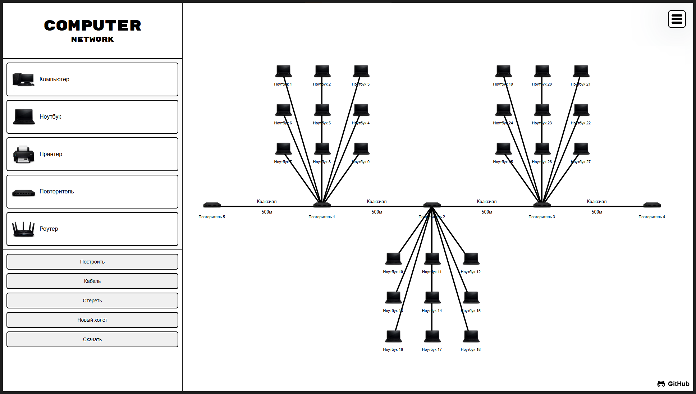
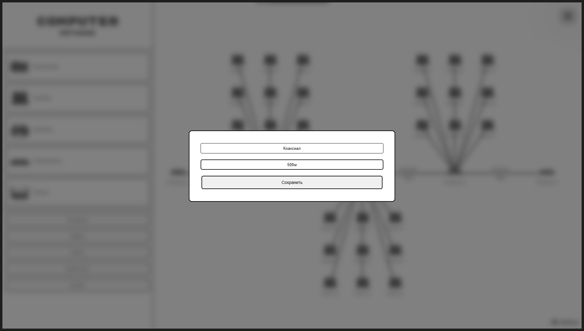
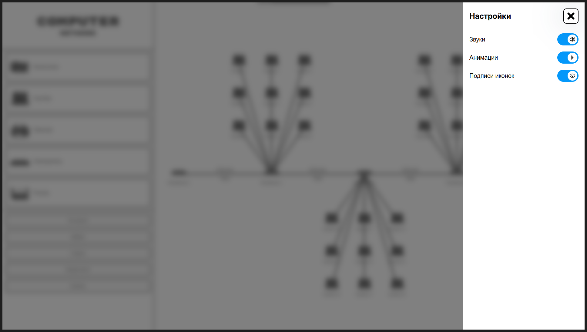

**[Русский](#русский) | [English](#english)**

---

## Русский

Браузерный конструктор компьютерных сетей на чистом JavaScript. Расставляйте устройства, соединяйте их кабелями и собирайте свою сеть прямо в браузере.
Проект сделан в процессе изучения JavaScript.

> Интерфейс приложения на русском языке.







### Строить онлайн

Попробовать браузерную версию можно здесь:

🌐 [Начать строить](https://khumorov.dev/ComputerNetwork)

### Возможности

1. Перетаскивание устройств (компьютер, ноутбук, принтер, повторитель, роутер) на рабочее поле
2. Соединение устройств кабелями
3. Можно описать кабель
4. Сохранение и загрузка сети (localStorage)
5. Настройки: звук, анимации, подписи иконок

### Технологии

- JavaScript (ES Modules)
- HTML5
- CSS3
- Vite

### Структура проекта

- `main.js`     - точка входа, инициализация приложения
- `world.js`    - рабочее поле и логика размещения устройств
- `elements.js` - определения устройств (компьютер, роутер, принтер и т.д.)
- `wires.js`    - логика соединения устройств кабелями
- `drag.js`     - перетаскивание элементов на рабочем поле
- `storage.js`  - сохранение и загрузка сети через localStorage
- `config.js`   - конфигурация приложения
- `helpers.js`  - вспомогательные функции
- `download.js` - экспорт/скачивание данных сети
- `style.css`   - стили интерфейса

### Запуск

Установите зависимости:

```
npm install
```

Запустите dev-сервер:

```
npm run dev
```

После запуска проект будет доступен по адресу:

```
http://127.0.0.1:5173
```

Адрес и порт можно изменить в конфигурации Vite.

### Сборка

Для создания продакшен-сборки:

```
npm run build
```

После этого готовая сборка будет находиться в директории `dist`.

### Лицензия

Проект распространяется под лицензией [MIT](./LICENSE).

---

## English

A browser-based computer network builder written in vanilla JavaScript. Place devices, connect them with cables, and build your network right in the browser.
Built as a learning project while studying JavaScript.

> the app's UI itself is in Russian.


### Try it online

You can try the browser version here:

🌐 [Start building](https://khumorov.dev/ComputerNetwork)

### Features

1. Drag-and-drop devices (computer, laptop, printer, repeater, router) onto the canvas
2. Connect devices with cables
3. Label cables
4. Save and load networks (localStorage)
5. Settings: sound, animations, icon labels

### Tech stack

- JavaScript (ES Modules)
- HTML5
- CSS3
- Vite

### Project structure

- `main.js`     - entry point, app initialization
- `world.js`    - canvas and device-placement logic
- `elements.js` - device definitions (computer, router, printer, etc.)
- `wires.js`    - cable-connection logic
- `drag.js`     - drag-and-drop for canvas elements
- `storage.js`  - saving/loading the network via localStorage
- `config.js`   - app configuration
- `helpers.js`  - utility functions
- `download.js` - exporting/downloading network data
- `style.css`   - UI styles

### Getting started

Install dependencies:

```
npm install
```

Start the dev server:

```
npm run dev
```

Once running, the project will be available at:

```
http://127.0.0.1:5173
```

The host and port can be changed in the Vite config.

### Build

To create a production build:

```
npm run build
```

The finished build will be in the `dist` directory.

### License

This project is distributed under the [MIT](./LICENSE) license.